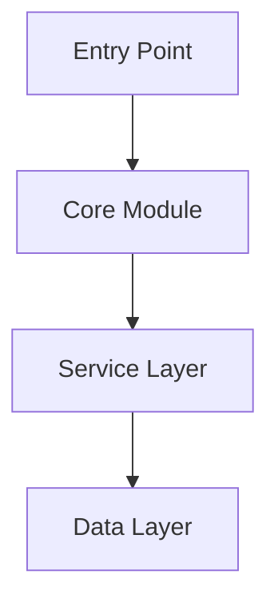
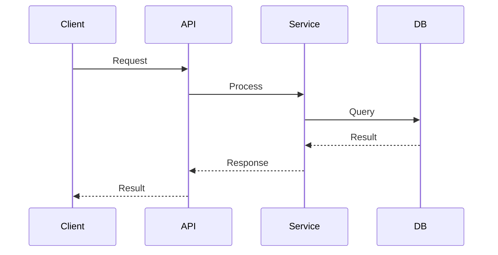
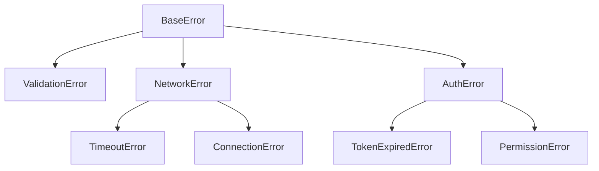

# Documentation Templates

Templates for generating consistent, AI-optimized documentation.

## Table of Contents
1. [Config File](#config-file)
2. [State File](#state-file)
3. [Overview](#overview)
4. [Architecture](#architecture)
5. [Function Documentation](#function-documentation)
6. [Type Documentation](#type-documentation)
7. [Feature Documentation](#feature-documentation)
8. [Error Documentation](#error-documentation)
9. [Index Files](#index-files)
10. [PR Description](#pr-description)
11. [Development Playbook](#development-playbook)
12. [Capability Map](#capability-map)
13. [Style Guide](#style-guide)
14. [Cross-Module Integration Map](#cross-module-integration-map)
15. [Consistency Report](#consistency-report)

---

## Config File

Path: `documentation/config.json`

```json
{
  "stack": "nodejs",
  "exclude": [
    "src/generated/**",
    "**/*.test.ts",
    "**/*.spec.ts",
    "**/node_modules/**",
    "**/dist/**",
    "**/build/**"
  ],
  "include_inline_examples": true,
  "include_architecture_diagrams": true,
  "docusaurus": null
}
```

With Docusaurus sync enabled:

```json
{
  "stack": "nodejs",
  "exclude": ["..."],
  "include_inline_examples": true,
  "include_architecture_diagrams": true,
  "docusaurus": {
    "repo": "git@github.com:org/docs-site.git",
    "branch": "main",
    "docs_path": "docs/api",
    "sidebar_label": "API Reference"
  }
}
```

Fields:
- `stack`: Detected language/framework
- `exclude`: Glob patterns to skip
- `include_inline_examples`: Generate usage examples
- `include_architecture_diagrams`: Generate mermaid diagrams
- `docusaurus`: Docusaurus sync config (null to disable)
  - `repo`: Git URL of Docusaurus repository
  - `branch`: Branch to push to
  - `docs_path`: Path within Docusaurus repo for docs
  - `sidebar_label`: Label for the sidebar category

Enhanced Config (with all optional feature blocks):

```json
{
  "stack": "nodejs",
  "exclude": ["..."],
  "include_inline_examples": true,
  "include_architecture_diagrams": true,
  "docusaurus": null,

  "frontend": {
    "enabled": true,
    "css_paths": [],
    "js_paths": [],
    "token_files": [],
    "build_tool": null,
    "methodology": null
  },

  "playbook": {
    "enabled": true,
    "custom_procedures": []
  },

  "capability_map": {
    "enabled": true,
    "custom_categories": []
  },

  "style_guide": {
    "enabled": true,
    "forbidden_patterns": ["!important", "inline styles"],
    "custom_rules": []
  },

  "integration_map": {
    "enabled": true
  },

  "consistency_check": {
    "enabled": true,
    "strict": false
  },

  "claude_md": {
    "inject_rules": true,
    "max_rules": 25,
    "custom_rules": []
  }
}
```

Enhanced fields:
- `frontend.enabled`: Scan for frontend assets. Default `true`. Set `false` for pure backend/library projects.
- `frontend.css_paths`: Directories to scan for CSS/SCSS. Auto-detected if empty.
- `frontend.js_paths`: Directories to scan for JS/TS frontend files. Auto-detected if empty.
- `frontend.token_files`: Explicit paths to design token files. Auto-detected if empty.
- `frontend.build_tool`: Build tool (`webpack`, `vite`, `gulp`, `rollup`, `esbuild`, `none`). Auto-detected if null.
- `frontend.methodology`: CSS methodology (`bem`, `smacss`, `utility`, `module`, `none`). Auto-detected if null.
- `playbook.enabled`: Generate playbook.md. Default `true`.
- `playbook.custom_procedures`: Additional procedure titles to document.
- `capability_map.enabled`: Generate capability-map.md. Default `true`.
- `capability_map.custom_categories`: Additional task categories beyond auto-detected.
- `style_guide.enabled`: Generate style-guide.md. Default `true`.
- `style_guide.forbidden_patterns`: Patterns to flag as anti-patterns.
- `style_guide.custom_rules`: Additional rules to include verbatim.
- `integration_map.enabled`: Generate integration-map.md. Default `true`.
- `consistency_check.enabled`: Run consistency checks in incremental mode. Default `true`.
- `consistency_check.strict`: If `true`, high-confidence violations are errors. Default `false`.
- `claude_md.inject_rules`: Inject project-specific rules into CLAUDE.md. Default `true`.
- `claude_md.max_rules`: Maximum rules to inject. Default `25`.
- `claude_md.custom_rules`: Additional rules to inject verbatim.

---

## State File

Path: `documentation/.docstate`

```json
{
  "last_commit": "a1b2c3d4e5f6789...",
  "last_run": "2025-01-29T15:30:00Z"
}
```

With Docusaurus sync enabled:

```json
{
  "last_commit": "a1b2c3d4e5f6789...",
  "last_run": "2025-01-29T15:30:00Z",
  "docusaurus_last_sync": "2025-01-29T15:35:00Z",
  "docusaurus_synced_files": [
    "public/functions/create-user.md",
    "public/types/user.md"
  ]
}
```

Enhanced state (with pattern tracking and frontend stats):

```json
{
  "last_commit": "a1b2c3d4e5f6789...",
  "last_run": "2026-03-03T12:00:00Z",
  "docusaurus_last_sync": null,
  "docusaurus_synced_files": [],
  "consistency_last_check": "2026-03-03T12:00:00Z",
  "consistency_violations": 0,
  "generated_docs": [
    "overview.md",
    "architecture.md",
    "playbook.md",
    "capability-map.md",
    "style-guide.md",
    "integration-map.md"
  ],
  "detected_patterns": {
    "rest_endpoint": {
      "description": "Router → Controller → Model",
      "glob": "src/controllers/*.php",
      "base_class": "BaseController",
      "required_methods": ["handle", "validate"]
    },
    "data_access": {
      "description": "Model static methods with caching",
      "glob": "src/models/*.php",
      "base_class": "BaseModel",
      "required_methods": ["save", "to_array", "get_by"]
    },
    "frontend_css": {
      "description": "Component SCSS files",
      "glob": "src/css/blocks/*.scss"
    },
    "frontend_js": {
      "description": "Block entry points with .init()",
      "glob": "src/js/blocks/*.js"
    }
  },
  "frontend_stats": {
    "important_count": 0,
    "inline_style_count": 0,
    "token_count": 42,
    "breakpoint_count": 4
  }
}
```

Notes:
- `detected_patterns`: Structured patterns enable consistency checking without full re-scan. Each pattern has a description (human-readable), glob (file path pattern), and optional base_class/required_methods.
- `frontend_stats`: Track frontend health between runs.
- `generated_docs`: List of generated documentation files (for regenerate mode targeting).

---

## Overview

Path: `documentation/overview.md`

```markdown
# [Project Name]

> [One-line description]

## Purpose

[What problem this project solves, 2-3 sentences]

## Primary Entry Points

| Entry Point | Purpose | Import |
|-------------|---------|--------|
| `functionName` | Brief description | `import { functionName } from 'package'` |

## Quick Start

[Minimal working example, 5-10 lines]

## Dependencies

| Dependency | Purpose | Required |
|------------|---------|----------|
| `dep-name` | What it provides | Yes/No |

## Requirements

- Runtime: [e.g., Node.js >= 18]
- Platform: [Any constraints]
```

---

## Architecture

Path: `documentation/architecture.md`

```markdown
# Architecture

## Component Overview

[Mermaid diagram showing main components]



## Data Flow

[Describe how data moves through the system]



## Design Patterns

| Pattern | Location | Purpose |
|---------|----------|---------|
| Repository | `src/repositories/` | Data access abstraction |
| Factory | `src/factories/` | Object creation |

## Architectural Decisions

### [Decision Title]

**Context**: [Why this decision was needed]

**Decision**: [What was decided]

**Consequences**: [Trade-offs and implications]

## External Dependencies

| Service | Purpose | Configuration |
|---------|---------|---------------|
| PostgreSQL | Primary database | `DATABASE_URL` |
```

---

## Function Documentation

Path: `documentation/public/functions/[module]/[function-name].md`

```markdown
# functionName

> Brief one-line description.

## Signature

```typescript
function functionName(
  param1: string,
  param2: number,
  options?: Options
): Promise<Result>
```

## Description

Detailed explanation of what this function does, when to use it,
and any important context.

## Parameters

| Name | Type | Required | Default | Description |
|------|------|----------|---------|-------------|
| param1 | `string` | Yes | - | Description of param1 |
| param2 | `number` | Yes | - | Description of param2 |
| options | `Options` | No | `{}` | Configuration options |
| options.timeout | `number` | No | `5000` | Timeout in milliseconds |
| options.retries | `number` | No | `3` | Number of retry attempts |

## Returns

**Type**: `Promise<Result>`

Returns a Result object containing:
- `success`: boolean indicating operation status
- `data`: the processed data when successful
- `error`: error details when unsuccessful

## Errors

| Error | Condition | Recovery |
|-------|-----------|----------|
| `ValidationError` | When param1 is empty | Provide non-empty string |
| `TimeoutError` | When operation exceeds timeout | Increase timeout or retry |
| `NetworkError` | When connection fails | Check network, retry later |

## Example

```typescript
import { functionName } from 'package';

const result = await functionName('input', 42, {
  timeout: 10000,
  retries: 5
});

if (result.success) {
  console.log(result.data);
}
```

## Safety Considerations

- **Thread Safety**: Safe for concurrent calls
- **Idempotency**: Multiple calls with same input produce same result
- **Side Effects**: Writes to database
- **Resource Cleanup**: Automatically closes connections

## Related

- [relatedFunction](./relatedFunction.md) - Does related thing
- [ResultType](../../types/ResultType.md) - Return type definition
```

---

## Type Documentation

Path: `documentation/public/types/[type-name].md`

```markdown
# TypeName

> Brief description of what this type represents.

## Definition

```typescript
interface TypeName {
  id: string;
  name: string;
  email: string;
  createdAt: Date;
  metadata?: Record<string, unknown>;
}
```

## Fields

| Field | Type | Required | Description |
|-------|------|----------|-------------|
| id | `string` | Yes | Unique identifier, UUID format |
| name | `string` | Yes | Display name, 1-100 characters |
| email | `string` | Yes | Email address, must be valid format |
| createdAt | `Date` | Yes | When the record was created |
| metadata | `Record<string, unknown>` | No | Arbitrary key-value data |

## Validation Rules

- `id`: Must be valid UUID v4
- `name`: Non-empty, max 100 characters
- `email`: Must match email regex pattern

## Serialization

**JSON**:
```json
{
  "id": "550e8400-e29b-41d4-a716-446655440000",
  "name": "John Doe",
  "email": "john@example.com",
  "createdAt": "2025-01-29T15:30:00Z"
}
```

**Notes**:
- `createdAt` serializes as ISO 8601 string
- `metadata` keys are preserved as-is

## Related Types

- [CreateTypeRequest](./CreateTypeRequest.md) - Input for creating this type
- [UpdateTypeRequest](./UpdateTypeRequest.md) - Input for updating this type

## Used By

- [createTypeName](../functions/module/createTypeName.md)
- [getTypeName](../functions/module/getTypeName.md)
- [updateTypeName](../functions/module/updateTypeName.md)
```

---

## Feature Documentation

Path: `documentation/public/features/[feature-name].md`

```markdown
# Feature Name

> One-line description of the feature.

## Overview

[2-3 paragraph explanation of what this feature does and why it exists]

## Configuration

| Option | Type | Default | Description |
|--------|------|---------|-------------|
| enabled | `boolean` | `true` | Enable/disable feature |
| mode | `string` | `"auto"` | Operating mode |

### Enabling

```typescript
import { configure } from 'package';

configure({
  featureName: {
    enabled: true,
    mode: 'strict'
  }
});
```

## Public API

| Function/Type | Description |
|---------------|-------------|
| [mainFunction](../functions/feature/mainFunction.md) | Primary function |
| [FeatureConfig](../types/FeatureConfig.md) | Configuration type |

## Integration Examples

### Basic Usage

```typescript
import { feature } from 'package';

const result = await feature.process(input);
```

### Advanced Usage

```typescript
import { feature, FeatureConfig } from 'package';

const config: FeatureConfig = {
  // ...
};

const processor = feature.createProcessor(config);
const result = await processor.run(input);
```

## Limitations

- Maximum input size: 10MB
- Rate limit: 100 requests/minute
- Not supported in browser environment

## Edge Cases

| Scenario | Behavior |
|----------|----------|
| Empty input | Returns empty result |
| Invalid format | Throws `ValidationError` |
| Timeout | Retries up to 3 times |
```

---

## Error Documentation

### Error Patterns

Path: `documentation/public/errors/patterns.md`

```markdown
# Error Handling Patterns

## Error Hierarchy



## Base Error Structure

All errors extend `BaseError`:

```typescript
class BaseError extends Error {
  code: string;
  context?: Record<string, unknown>;
}
```

## Error Propagation

Errors propagate up the call stack with context:

```typescript
try {
  await service.process(data);
} catch (error) {
  if (error instanceof ValidationError) {
    // Handle validation
  } else if (error instanceof NetworkError) {
    // Handle network issues
  }
  throw error; // Re-throw unknown errors
}
```

## Recovery Strategies

| Error Type | Strategy |
|------------|----------|
| `ValidationError` | Fix input data |
| `TimeoutError` | Retry with backoff |
| `TokenExpiredError` | Refresh token, retry |
| `RateLimitError` | Wait, then retry |
```

### Error Category

Path: `documentation/public/errors/[error-category].md`

```markdown
# Validation Errors

Errors related to input validation.

## ValidationError

**Thrown when**: Input fails validation rules

**Properties**:
| Property | Type | Description |
|----------|------|-------------|
| field | `string` | Field that failed validation |
| rule | `string` | Rule that was violated |
| value | `unknown` | The invalid value |

**Example**:
```typescript
try {
  validate(input);
} catch (error) {
  if (error instanceof ValidationError) {
    console.log(`Field ${error.field} failed: ${error.rule}`);
  }
}
```

**Recovery**: Correct the input value according to the rule

## SchemaError

**Thrown when**: Data doesn't match expected schema

**Recovery**: Ensure data conforms to documented schema
```

---

## Index Files

Path: `documentation/[section]/_index.md`

```markdown
# [Section] Index

Quick reference for all [section] items.

## Summary

| Item | Description | Added | Status |
|------|-------------|-------|--------|
| [item1](./item1.md) | Brief description | v1.0 | Stable |
| [item2](./item2.md) | Brief description | v1.2 | Stable |
| [item3](./item3.md) | Brief description | v2.0 | Beta |

## By Category

### Authentication
- [login](./auth/login.md)
- [logout](./auth/logout.md)

### Data Processing
- [process](./data/process.md)
- [transform](./data/transform.md)

## Recently Updated

| Item | Change | Date |
|------|--------|------|
| [item1](./item1.md) | Added retry parameter | 2025-01-29 |

## Deprecated

| Item | Replacement | Remove By |
|------|-------------|-----------|
| [oldItem](./oldItem.md) | [newItem](./newItem.md) | v3.0 |
```

---

## PR Description

```markdown
## Documentation Update

**Commit range**: `abc123..def456`

### Summary

- Added: X functions, Y types
- Modified: X functions, Y types
- Removed: X functions (marked deprecated)

### Details

#### Added
- `public/functions/auth/validateToken.md` - New token validation function
- `public/types/TokenClaims.md` - JWT claims type definition

#### Modified
- `public/functions/auth/login.md` - Added optional `remember` parameter
- `public/functions/api/createUser.md` - Now throws `DuplicateEmailError`

#### Removed
- `public/functions/auth/legacyLogin.md` - Marked deprecated, use `login` instead

### Consistency Check

**Status**: [PASS | X errors, Y warnings]

#### Violations Found

| File | Line | Rule | Severity | Description |
|------|------|------|----------|-------------|
| `path/to/file` | 42 | ARCH-002 | Warning | Direct database query; should use Model::get_by() |

#### Suggestions

- `path/to/file:42` — Replace direct query with `Model::get_by()` per `documentation/playbook.md`
```

Include Consistency Check section only when `config.consistency_check.enabled` is `true`. Omit the section entirely when consistency checking is disabled.

---

## Development Playbook

Path: `documentation/playbook.md`

````markdown
# Development Playbook

> Step-by-step procedures for common development tasks in this project.
> Follow these procedures to maintain architectural consistency.

## Before You Start

Before adding any new functionality:
1. Check `capability-map.md` to see if similar functionality exists
2. Read `architecture.md` to understand the system structure
3. Follow the appropriate procedure below

## Adding a New [Pattern Name]

### When to Use
[Description of when this procedure applies]

### Steps

1. [Concrete step with file paths and naming conventions]
2. [Next step]
3. [Next step]

### Template

```[language]
[Boilerplate code that follows the pattern]
```

### Checklist

- [ ] [Verification item]
- [ ] [Verification item]
- [ ] Documentation updated

### Common Mistakes

- **Don't**: [Anti-pattern description]
  **Do**: [Correct approach]

---

[Repeat for each detected pattern]
````

Notes:
- Generate one "Adding a New [X]" section for each design pattern detected in `architecture.md`
- Steps must include concrete file paths, directory conventions, base classes, and naming patterns
- Template code block should be a working boilerplate that follows the detected pattern
- Checklist items are derived from the pattern requirements (e.g., required methods, registration steps)
- Common Mistakes are derived from detected anti-patterns in the codebase

---

## Capability Map

Path: `documentation/capability-map.md`

```markdown
# Capability Map

> Find existing functionality before creating something new.

**IMPORTANT**: Before implementing any new utility, helper, or shared
function, search this document to check if it already exists.

## [Category Name]

[One-line description of this category]

| Capability | Function/Type | Module | Import/Path |
|------------|--------------|--------|-------------|
| [What it does] | [`functionName()`](link) | ModuleName | `Namespace\Class` or `import path` |

---

[Repeat for each category]
```

Notes:
- This is NOT an exhaustive listing of all public functions (that's `public/_index.md`). It is a curated lookup of the capabilities most commonly needed during development.
- Build incrementally during the codebase scan — classify each function into a domain category as it is discovered.
- A function can appear in multiple categories if it serves multiple purposes.
- Within each category, order by likelihood of use (most referenced functions first).
- Minimum 3 categories required; detect what's relevant for each project.
- Common categories: Authentication, Data Retrieval, Data Persistence, Validation, Error Handling, Caching, File Handling, Search, External APIs, Logging, Configuration, Frontend Utilities, Styling Utilities.

---

## Style Guide

Path: `documentation/style-guide.md`

```markdown
# Style Guide

> Frontend conventions and rules for this project.

## CSS Methodology

**Approach**: [Detected methodology: BEM | SMACSS | Utility-first | CSS Modules | Component-scoped]

### File Organization

| Type | Location | Naming Convention |
|------|----------|-------------------|
| [Block/Component styles] | [path] | [convention] |
| [Global styles] | [path] | [convention] |
| [Utility styles] | [path] | [convention] |

### Naming Conventions

[Detected class naming pattern with examples]

**Pattern**: `[detected pattern, e.g., .block-name__element--modifier]`

**Examples from codebase**:
- `.header__nav--active`
- `.card__title`

## Design Tokens

### Colors

| Token | Value | Usage |
|-------|-------|-------|
| `$token-name` | `#value` | [Where it's used] |

### Spacing

| Token | Value |
|-------|-------|
| `$token-name` | `value` |

### Typography

| Token | Value |
|-------|-------|
| `$font-family-name` | `value` |

### Breakpoints

| Name | Value | Usage |
|------|-------|-------|
| `$breakpoint-name` | `value` | [mobile-first/desktop-first] |

## JavaScript Patterns

### Component Initialization

[Detected pattern with example]

### Entry Points

| File | Purpose | Dependencies |
|------|---------|-------------|
| [path] | [what it initializes] | [deps] |

## Rules

1. [Generated rule from detected patterns]
2. [Generated rule]

## Forbidden Patterns

| Pattern | Reason | Alternative |
|---------|--------|-------------|
| `!important` | Causes specificity issues | Use more specific selectors |
| Inline styles | Not maintainable | Use CSS classes |
| [Other detected anti-pattern] | [Reason] | [Alternative] |
```

Notes:
- Only generated when `config.style_guide.enabled` is `true` AND frontend assets are detected.
- Design Tokens section is populated from the frontend scan results. Include all detected tokens with their actual values.
- Rules section is generated from detected patterns — convert each convention into an imperative rule.
- Forbidden Patterns always includes items from `config.style_guide.forbidden_patterns` plus any anti-patterns detected during scanning.
- Include `config.style_guide.custom_rules` verbatim in the Rules section.

---

## Cross-Module Integration Map

Path: `documentation/integration-map.md`

````markdown
# Cross-Module Integration Map

> How modules communicate with each other in this project.

## Module Dependency Matrix

| Module | Depends On | Interface Type | Through |
|--------|-----------|---------------|---------|
| [Module A] | [Module B] | [function call/event/API/shared DB] | [`functionName()`](link) |

## Integration Patterns

### [Module A] → [Module B]

**Context**: [When/why Module A calls Module B]

**Pattern**:
```[language]
[Code showing the correct way to make this call]
```

**Data Contract**:
| Parameter | Type | Description |
|-----------|------|-------------|
| [param] | [type] | [description] |

**Returns**: [What Module B returns to Module A]

## Shared Resources

| Resource | Type | Modules | Access Pattern |
|----------|------|---------|----------------|
| [table/cache key/config] | [DB table/Cache/Global/Config] | [List of modules] | [Read/Write/Both] |

## Event/Hook Contracts

| Event/Hook | Emitted By | Listened By | Data Payload |
|-----------|-----------|------------|--------------|
| [event name] | [Module] | [Module(s)] | [Data type/shape] |
````

Notes:
- Module boundaries are detected by namespace/package/directory structure.
- Integration Patterns include one section per module-pair that communicates.
- For WordPress: events/hooks are populated from `add_action`/`add_filter`/`do_action`/`apply_filters` analysis.
- For Django: populated from signal connections.
- For Spring: populated from ApplicationEvent and @EventListener analysis.
- Shared Resources section includes database tables, cache keys, and configuration values accessed by multiple modules.

---

## Consistency Report

Path: `documentation/.consistency-report.md`

```markdown
# Consistency Report

> Generated by incremental documentation update on [date].

## Summary

**Status**: [PASS | X errors, Y warnings]
**Files checked**: [count]
**Rules applied**: [count]

## Violations

| File | Line | Rule | Confidence | Severity | Description |
|------|------|------|-----------|----------|-------------|
| `path/to/file` | 42 | ARCH-002 | High | Error | Direct database query; should use Model |
| `src/css/new.scss` | 15 | FE-001 | High | Warning | !important usage |
| `src/utils/helper.ts` | 8 | ARCH-010 | Best-effort | Warning | May duplicate existing `formatDate()` |

## Suggestions

### High Confidence

- `path/to/file:42` — Replace direct query with `Model::get_by()` per `documentation/playbook.md`
- `src/css/new.scss:15` — Remove `!important`, use more specific selector per `documentation/style-guide.md`

### Review Suggested

- `src/utils/helper.ts:8` — Check if `formatDate()` in `documentation/capability-map.md` already does what you need

## No Violations Variant

When no violations are found:

# Consistency Report

> Generated by incremental documentation update on [date].

## Summary

**Status**: PASS
**Files checked**: [count]
**Rules applied**: [count]

No consistency violations detected.
```

Notes:
- Generated during step 3.4.5 (Consistency Check) in incremental mode.
- High-confidence violations are listed in "High Confidence" suggestions section with direct fix instructions.
- Best-effort findings are listed in "Review Suggested" section with exploratory language.
- This file is committed alongside documentation updates.
- Results are also included in the PR description (see PR Description template).
